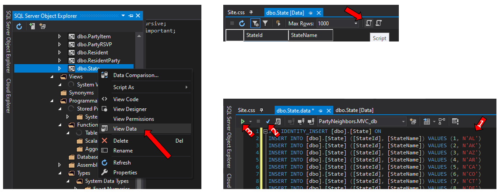
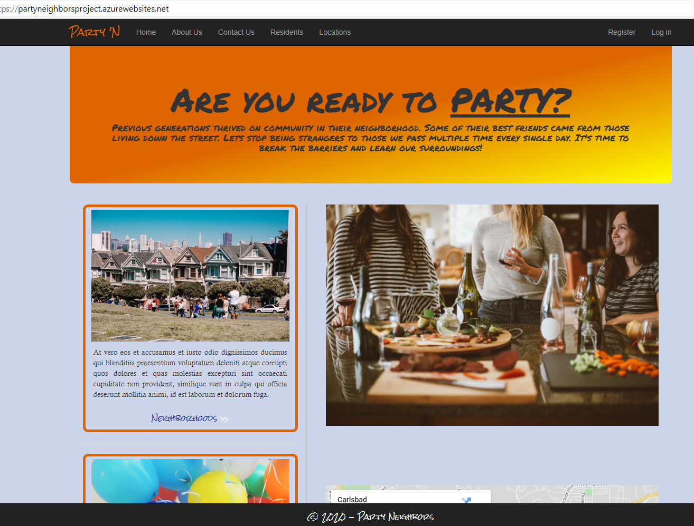

# Party Neighbors
#### https://partyneighborsproject.azurewebsites.net/ (live as of 7/25/2020)

### The What
The intent of this project is to build an app where anyone can become more aware of their surroundings, no matter what neighborhood they live in. The post-WWII era was filled with block parties and neighborhoods with the best of friends. Everyone knew everyone, especially those living on your block.

### The Why
With all the social media and "networking" there is today, people are more disconnected than we have seen before. It is time to change that. It is time to reconnect people with people and actually live life, rather than just work all day and watch tv all night. It is time for a socially responsible, yet invigorating revolution.

### The How
This app uses ASP .Net with primarily C#. HTML, CSS, Bootstrap, and Razor syntax are all used in the MVC front end. Some Javascript and JQuery are also included with Bootstrap and for the dynamic functionality everyone loves so much.
1. .Net 4.8
2. Entity Framework 6 (EF6)
3. Bootstrap 3
4. JQuery 3
5. Razor 3
6. MVC 5

### The Process
Upon initial compiling of the database, there is a "State" table that must be populated before one is able to create Resident accounts, Neighborhoods, and Parties.
The file "dbo.State.data.sql" in the Party Neighbors main folder contains the necessary scripts for inserting all 50 states into the table. 

Open the database, view data for State.dbo, click Script icon (the open scroll) and paste all of the data from the text file. Then click Parse (blue check mark) and Execute (green play button) to finalize the load into the table.

Once the states are loaded in, you can begin creating Neighborhoods. After Neighborhoods you can create Residents. Locations are the venues within a community that could be utilized for a party (i.e. pool, park, lounge, etc.) Once States, Neighborhoods, and Locations are established, you are able to create a Party. These require a name, date and time, neighborhood, and location. They also include a host- this information is captured from the user creating the party, as they will be recorded as the party host.

### The Functionality
Each entity has Create, Read, Update, and Delete (CRUD) functionality. All fields showing in the Create path are required fields. Within the Index view for each entity there is a search bar that will search all text within it's respective table.

## About Me
I am a software developer and this is my final project at Eleven Fifty Academy. I have had a blast learning .Net and full stack development. I came in knowing some Python and SQL, and HTML 4 from the early 2000s. I have since grown my skills and expertise to include software development, full stack, and really enjoyed learning the back-end development. This project is something I actually think should be happening. I am not a super social person in my off time, however, I do think it is vital to an enjoyable life to get to know those closest to us. 

